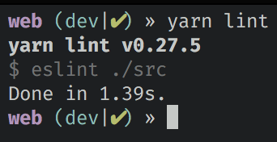
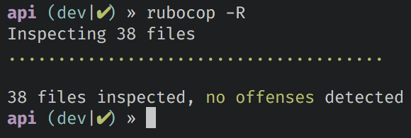

### Lint

>  lint is a Unix utility that flags some suspicious and non-portable constructs (likely to be bugs) in C language source code; generically, lint or a linter is any tool that flags suspicious usage in software written in any computer language language.  
[Wikipedia]

Linting es el proceso de revisar código en busca de errores programáticos asi como también de errores de estilo.
Hoy las herramientas para esto son altamente configurables, permitiendo definir reglas particulares sobre se quiere que un proyecto sea revisado.
Tener un sistema de lint ayuda en la evaluación de la calidad del software, en términos de errores y de estilo.

En el desarrollo del proyecto se tendrán dos sistemas, una api en [Ruby on Rails] y un frontend web en [React JS].
Por ello se configuró un sistema de lint para cada uno.

Para la api se tomó la decisión de utilizar un linter robusto y muy usado, [Rubocop].
Rubocop fuerza buenas prácticas en el desarrollo.
Por ejemplo, avisa si se tienen controladores con demasiada lógica.
Un controlador con demasiadas lineas es un indicador de que o está haciendo demasiadas cosas que deberían separarse (podría ser baja Cohesión), o que el controlador tiene lógica que podría estar mejor en la declaración de un modelo.
Otro ejemplo es que Rubocop revisa si se respetan convenciones de Rails (necesarias para su buen funcionamiento), como los nombres de clases y variables (CamelCase y snake_case).

Para el frontend web se tomó la decisión de utilizar un linter muy usado, [Eslint] (`eslint:recommended`) y también el más estandar de React [Eslint plugin React].
Estos permiten encontrar problemas típicos de JS y de React.
Encima de ello se utilizó [Prettier], el cual esta más enfocado a estilo (por preferencia de un desarrollador del grupo).

Con ambos linters configurados basta con correr los siguientes comandos en cada repo para encontrar potenciales errores y problemas de estilo:

```bash
# ~/repo/web
yarn lint

# ~/repo/api
rubocop -R
```

Además los sistemas de lint tienen la opción de tratar de arreglar los errores:

```bash
# ~/repo/web
yarn lint:fix

# ~/repo/api
rubocop -Ra
```

Y si todo esta bien deberiamos ver un output parecido a:



<!-- Links -->
[Wikipedia]:https://en.wikipedia.org/wiki/Lint_(software)
[Ruby on Rails]:http://rubyonrails.org
[Rubocop]:https://github.com/bbatsov/rubocop
[React]:https://facebook.github.io/react/
[Eslint]:https://eslint.org/docs/rules/
[Eslint plugin React]:https://github.com/yannickcr/eslint-plugin-react
[Prettier]:https://github.com/prettier/prettier
