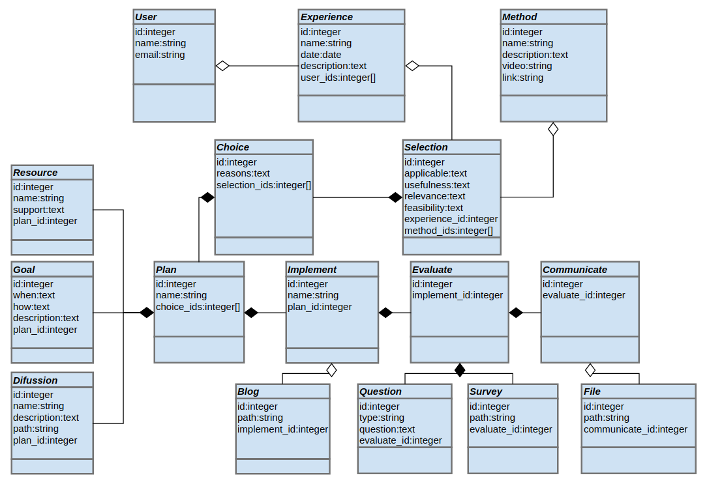

### Diagrama de clases

En la E1 se debian realizar diagramas. Entre ellos hicimos un diagrama de clases, el cual se presenta a continuación

Un diagrama de clases presenta la idea de las clases que van a interactuar en un programa, junto con los atributos más importantes de estas.
También muestra las relaciones entre las clases.
Esto sirve para los desarrolladores para tener una primera visión sobre como debería ser su programa.

A la hora de desarrollar el proyecto es un artefacto potente ya que permite de manera fácil (y barata) encontrar posibles problemas.
Por ejemplo, si una clase tiene muchas conexiones es una alerta de que tenemos demasiadas dependencias y un alto acoplamiento, o que la clase en particular tiene alta cohesión.
Esto nos ayuda ya que podemos solucionar problemas de diseño antes de siquiera haber escrito una línea de código.
