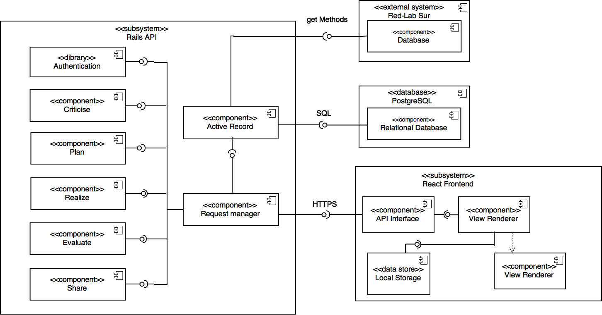

### Diagrama de componentes

En la E2 parte 1 se debía realizar un diagrama de componentes, el cual se presenta a continuación:

Un diagrama de componentes presenta las "piezas grandes" que van a interactuar en el desarrollo de un sistema.
También muestra como estos se comunican entre ellos.
Y debe cumplir con ser lo suficientemente auto explicativo para dar una idea sobre como funciona el sistema en general.
Esto le permite al equipo tener una mirada a alto nivel sobre las interacciones en el sistema y poder encontrar problemas, por ejemplo si se debe separar un componente que tiene demasiadas conexiones en dos distintos.

Es un artefacto importante ya que, entre otras cosas, permite ordenar a los equipos de mejor manera.
Por ejemplo, ahora que se tienen los componentes definidos cada parte del equipo puede enfocarse en el desarrollo de un componente en particular, definiendo por ejemplo las clases que formarán parte de el y como se implementará la comunicación.
