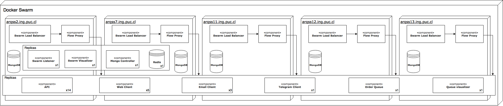

### Diagrama de deployment

En el curso de Arquitectura de Sistemas de Software se desarrolló un proyecto que combinaba el trabajo de muchos componentes (microservicios). Este consistió en distintos clientes (web, email y bot telegram), una API intermedia y un sistema de cola. El objetivo era crear un sistema por sobre una API externa que tenía problemas de escalabilidad. Dicha API exponía métodos para obtener información de productos de una farmacia y poder comprar dichos productos para recibirlos en el hogar.

A la hora de definir el deployment del sistema se utilizó docker swarm, un sistema de docker que permite facilitar el manejo de tener replicas de distintos sistemas repartidas en distintas máquinas. El diagrama del deployment se adjunta a continuación

Un diagrama de deploy define como se reparten los distintos componentes de un sistema a través de distintos servidores. También como estos se conectan entre ellos. Esto ayuda al equipo a entender la distribución de ellos. Sirve también para poder identificar problemas o restricciones de comunicación entre componentes que pudieran aparecer.

Este diagrama en partícular muestra como todos los componentes se encuentran dentro de un swarm de docker, por lo cual no se muestran las conexiones entre componentes, ya que en el swarm todos los componentes se comunican internamente (como si estuvieran en la misma máquina)

El diagrama sirve no solo para que el equipo sepa como esta distribuido el sistema, también es muy valioso a la hora de explicar a terceros como funciona el sistema. En particular, este se uso para la presentación de ramo, permitiendo que el profesor y ayudantes entiendad a cabalidad la distribución de piezas del sistema. También lo entendieron alumnos de los otros grupos, incluso algunos de mi propio grupo que no tenían muy claro esto.
